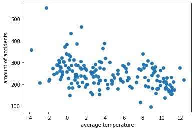
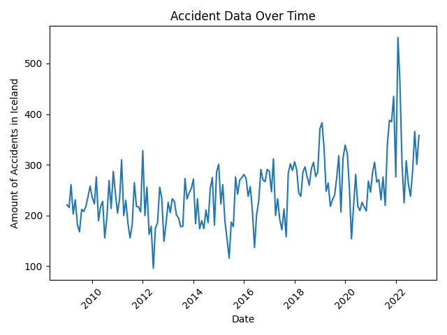
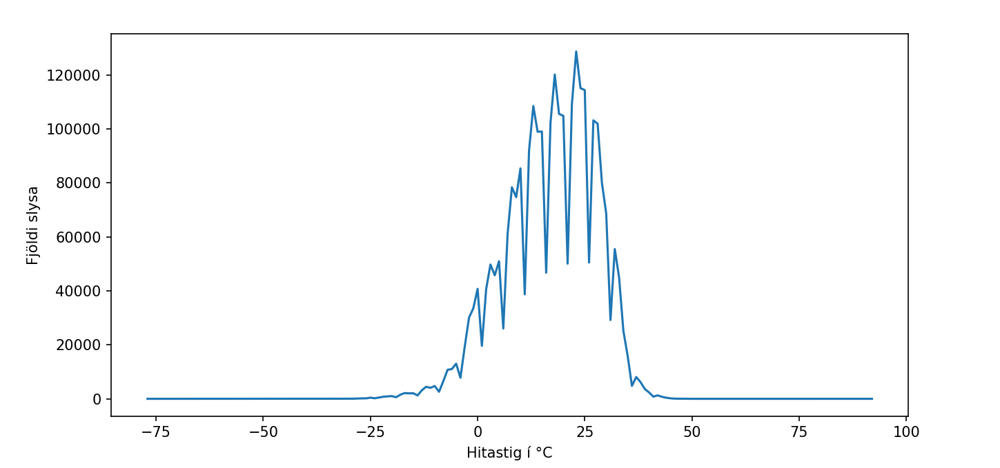
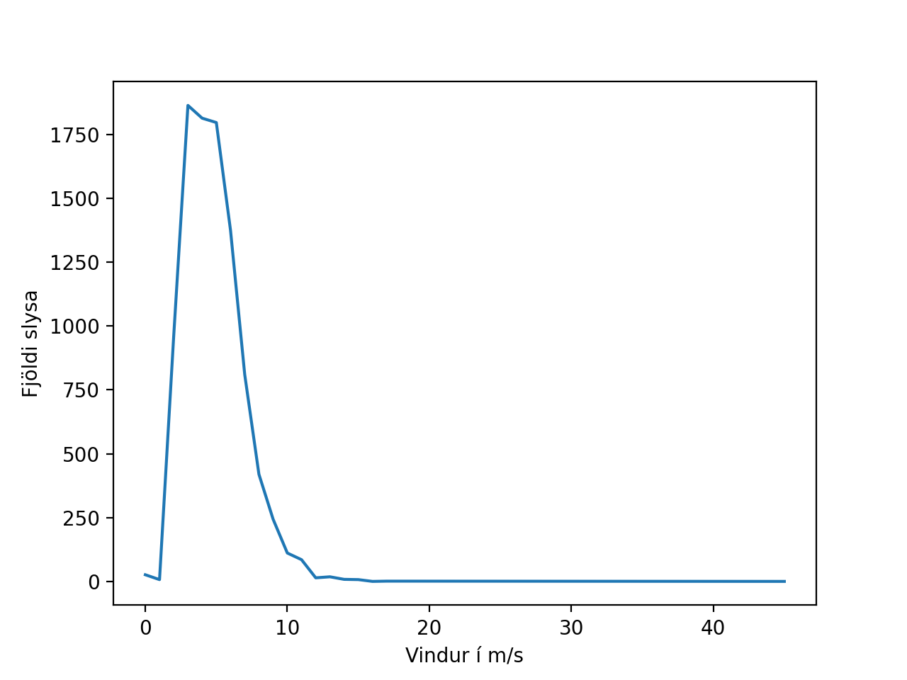
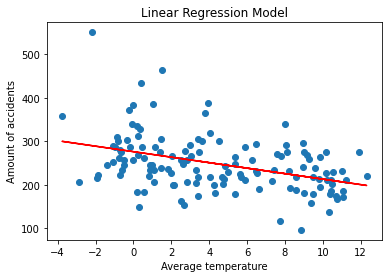

# Predicting the amount of accidents in the month based on its average temperature and wind-speed

authors: Tómas, Gunnar, Sigurdur Haukur

## The data

We used the data from the [Icelandic Meteorological Office](https://en.vedur.is/) and the [Icelandic Transport Authority](https://www.icetra.is/) to get the weather and accident data respectively. In addition to that we used the [US Accidents (2016 - 2021)](https://www.kaggle.com/datasets/sobhanmoosavi/us-accidents) for more in-detailed data.

The weather data is in the `weather` folder and the accident data is in the `accidents` folder.

There seems to be a correlation between the amount of accidents and the average temperature. The graph below shows the amount of accidents per month in Iceland from 2009 to 2023. The graph is very noisy, but it seems like there is a correlation between the amount of accidents and the average temperature. We can also see the seasonality of accidents in Iceland in the graph of amount of accidents against time. This is probably because of the snow and ice on the roads.

The dataset from Kaggle, US Accidents (2016 - 2021), shows a clear correlation between the amount of accidents and the average temperature at the time of the accident. See the graph below. The trend is not linear, the data forms a curve. That's why we trained the model on the log of the temperature.

The graph below shows the amount of accidents and the wind-speed at the time of the accident. There seems to be a correlation between the amount of accidents and the wind-speed. The graph does not contain as many datapoints, but there is a correlation between the amount of accidents and the wind-speed.

## The models

We trained two models. One for the Icelandic data and one for the US data. Both models are linear regression models and predict the amount of accidents in the month based on its average temperature, but the US model also uses the wind-speed (it was trained on the Us Accidents dataset stated above).

## Results

### The Icelandic model

Below is a figure of the Icelandic model. The model is statistically significant, but the R-squared score is low. This means that the model is not a good fit for the data. The cross-validation scores are also low, which means that the model is not good at generalizing to new data. However, the model is still statistically significant, which means that it is better than a model that just predicts the average amount of accidents per month. The data it was trained on is also very noisy, which makes it harder to train a good model, especially because the data points are so few.

The table below shows the statistics of the model.

| Metric                    | Value                                                            | Interpretation                    |
| ------------------------- | ---------------------------------------------------------------- | --------------------------------- |
| Mean Squared Error (MSE)  | 2128.68                                                          | Lower values indicate better fit  |
| Mean Absolute Error (MAE) | 39.46                                                            | Lower values indicate better fit  |
| R-squared Score (R2)      | 0.14                                                             | Higher values indicate better fit |
| Cross-Validation Scores   | [-0.47525246, -1.15262578, 0.17926531, -0.14678218, -0.29697801] | Higher values indicate better fit |

### The US model

The Us model has a validation score of 94%, which means that it is very good at generalizing to new data. It predicts the amount of accidents in the month based on its average temperature and wind-speed. The model is statistically significant, which means that it is better than a model that just predicts the average amount of accidents per month.

## Conclusion

Modeling the amount of car accidents based off of the temperature and wind-speed is possible.

## Appendix

statistics in the Icelandic dataset:

- Average accidents per month: 246
- Average temperature: 4.3893
- Standard deviation: 4.1323

statistics in the US dataset:

- Average accidents per month: 20 240.4
